# TABMON Listening Lab

This repository contains the source code for the TABMON Listening Lab, an interactive web application designed have users help us annotate the acoustic data collected by the [TABMON project](https://tabmon-eu.nina.no/).

## How it works

The TABMON Listening Lab connects to an S3 storage that hosts the audio data and the results from the AI models used to classify the bird songs. The audio data is presented to the users in the form of short audio clips (3 seconds) along with the AI model predictions. The users can listen to the audio clips and provide their annotations regarding the presence of bird species.

### Architecture

```mermaid
graph TB
    User[👤 User] --> |Selects parameters| Dashboard[🖥️ Streamlit Dashboard]

    Dashboard --> |Query metadata| DuckDB[🦆 DuckDB + httpfs]
    DuckDB --> |Read parquet files| S3_Data[(☁️ S3 Storage<br/>Parquet Files)]

    Dashboard --> |Request audio file| S3Search[🔍 S3 File Search]
    S3Search --> |List objects| S3_Audio[(☁️ S3 Storage<br/>Audio Files)]
    S3Search --> |Return file path| Dashboard

    Dashboard --> |Download & extract| AudioProcessor[🎵 Audio Processor<br/>librosa]
    S3_Audio --> |Download file| AudioProcessor
    AudioProcessor --> |3-second clip| Dashboard

    Dashboard --> |Display| User
    User --> |Validate| ValidationForm[✅ Validation Form]
    ValidationForm --> |Save response| S3_Validation[(☁️ S3 Storage<br/>validation_responses.csv)]

    DuckDB -.-> |Read validations| S3_Validation

    style Dashboard fill:#e1f5ff
    style DuckDB fill:#fff4e1
    style AudioProcessor fill:#ffe1f5
    style S3_Data fill:#e8f5e8
    style S3_Audio fill:#e8f5e8
    style S3_Validation fill:#e8f5e8
```



### Setup

1. Clone the repository:

```bash
git clone https://github.com/NINAnor/tabmon_species_api.git
```

2. Change the `.env` file and the `src/config.py` to set your S3 credentials and parameters

3. Run the container:

```bash
docker compose up --build -d
```

> [!WARNING]
> The `PARQUET_DATASET` and `SITE_INFO_S3_PATH` have a very specific format and you may need to modify the code to fit your own dataset.

### Contact

For questions or contributions, please contact me at [benjamin.cretois@nina.no](mailto:benjamin.cretois@nina.no). Feel free to open issues or pull requests on the GitHub repository.
